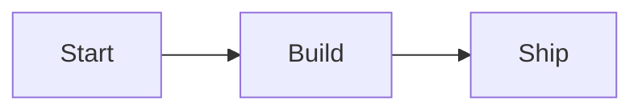

# mkdocs-hover-tooltip-popup

An MkDocs plugin that adds **per-node hover tooltip popups** to Mermaid diagrams, and **pan & zoom**
controls to Mermaid/D2 diagrams and images.

- **Hover tooltips**: declare a Markdown-rendered popup for any diagram node; it appears to the side
  of the node on hover (without covering it) and supports links, bold, font sizes, etc.
- **Pan & zoom**: drag to pan, wheel to zoom, with reset / fullscreen / zoom buttons and per-diagram
  state saved to `localStorage`.

> [Live Demo](https://elgalu.github.io/mkdocs-hover-tooltip-popup/)

Published packages <https://pypi.org/project/mkdocs-hover-tooltip-popup/>

## Setup

`pip install mkdocs-hover-tooltip-popup`

Add it to your `mkdocs.yml`:

```yml
plugins:
  - search
  - hover-tooltip-popup

```

> [!WARNING]
>Make sure to define the `site_url` otherwise it won't work!
>
>**Example**:
>
>```yaml
>site_url: https://elgalu.github.io/mkdocs-hover-tooltip-popup/
>```

## Usage

Examples and usage are available in the [docs](https://elgalu.github.io/mkdocs-hover-tooltip-popup/).

## Hover Tooltips

Attach a hover popup to any node of a Mermaid diagram with a `mermaid-tooltips` fenced block placed
right after the diagram it annotates. Each entry targets a node by its **id** or by its visible
**label text**, and `text` is full Markdown (rendered to HTML at build time).

````markdown


```mermaid-tooltips
- node: Start
  text: "The **entry point**. See the [docs](https://example.com)."
- node: Build
  text: "Supports `inline code`, *emphasis*, and <br>line breaks."
- node: Ship
  text: "Publishes the result."
```
````

Notes:

- Use the node **id** (e.g. `Start`) when it is a plain identifier; use the **visible label text**
  for labels containing spaces or punctuation.
- Tooltips are independent of pan & zoom: they work on any Mermaid diagram, including small ones that
  don't get pan/zoom controls.
- v1 supports Mermaid diagrams (D2 and images are planned).

## Config

### Selectors

Mermaid and D2 are included by default, but you can add any arbitrary selector or exclude the default ones.
To enable images add the `img` tag like below.

```yaml
plugins:
  - hover-tooltip-popup:
      include_selectors:
        - .myClass # class in html
        - "#myId" # id in html
        - "img" # tag in html
      exclude_selectors:
        - ".mermaid"
        - ".d2"
```

### Hint

This makes the hint on how to use it permanently visible.

```yaml
plugins:
  - hover-tooltip-popup:
      always_show_hint: true # default false
```

This changes the location of the hint

```yaml
plugins:
   - hover-tooltip-popup:
      hint_location: "top" # default bottom
```

### Use different key

Pan & Zoom is enabled by default. Options for the key to disable it (for text selection) are:

- alt
- ctrl
- shift
- none

```yaml
plugins:
  - hover-tooltip-popup:
      key: "ctrl" # default alt
```

### Set Initial Zoom Level

This sets the initial zoom level for all diagrams and images.

```yaml
plugins:
  - hover-tooltip-popup:
      initial_zoom_level: 1.5 # default 1.0
      zoom_step: 0.1 # default 0.2
```

### Exclude Pages

```yml
plugins:
  - hover-tooltip-popup:
      exclude:
        - Path/to/page.md
```

### Enable Fullscreen

```yml
plugins:
  - hover-tooltip-popup:
      full_screen: True # default False
```

### Hide/Show Zoom in/out Buttons

```yaml
plugins:
  - hover-tooltip-popup:
      show_zoom_buttons: true # default false
      buttons_size: "1.1em" # default "1.25em"
```

## Automatic Zoom State Persistence

The plugin automatically saves the zoom level and pan position for each diagram to your browser's localStorage. This means:

- **Persistent Settings**: Your preferred zoom level and position for each diagram are remembered across page reloads
- **Per-Diagram Memory**: Each diagram on a page maintains its own zoom state independently
- **Automatic Cleanup**: Saved states older than 30 days are automatically cleared
- **Reset Functionality**: Using the reset button clears the saved state for that diagram and returns to the configured initial zoom level

This feature works automatically - no additional configuration is required. The zoom states are stored locally in your browser
and are not shared between different browsers or devices.

## Star History

[](https://www.star-history.com/#elgalu/mkdocs-hover-tooltip-popup&Date)

## Credits

This project is a fork of [PLAYG0N/mkdocs-panzoom](https://github.com/PLAYG0N/mkdocs-panzoom)
(MIT, Copyright (c) 2024 PLAYG0N). The original pan/zoom plugin is by PLAYG0N; this fork adds
per-node hover tooltip popups and is published as `mkdocs-hover-tooltip-popup`.

The pan/zoom behavior is powered by the bundled [panzoom](https://github.com/anvaka/panzoom)
library by [Andrei Kashcha](https://github.com/anvaka) (MIT, Copyright (c) 2016-2024 Andrei Kashcha,
[LICENCE](./mkdocs_hover_tooltip_popup/panzoom/LICENCE)).

The structure and some parts are from the [enumerate-headings-plugin](https://github.com/timvink/mkdocs-enumerate-headings-plugin) ([LICENCE](./licences/enumerate-headings-plugin))
