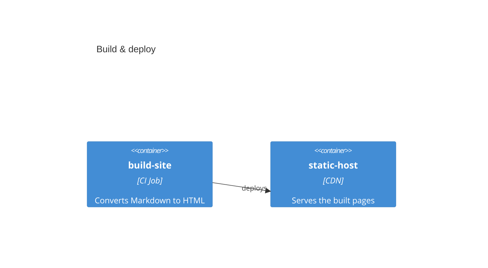

# Native Mermaid C4 (comparison)

This page renders the **same** example as [Custom Fonts & Styling Inside Nodes](custom-fonts.md)
— a build pipeline where a CI job deploys to a CDN — but using Mermaid's **native** `C4Container`
syntax instead of a hand-styled `flowchart` with `.c4-*` spans.

Compare the two:

- [Custom Fonts](custom-fonts.md): `flowchart` + `<span class='c4-name'>…</span>` labels + CSS tiers.
  Verbose label DSL, full control over per-tier typography.
- This page: native `C4Container(...)`. Clean DSL, but Mermaid owns the layout and styling.

## Native C4 syntax

<!-- markdownlint-disable MD013 -->

<!-- markdownlint-enable MD013 -->

The DSL is dramatically cleaner than the equivalent flowchart label:

```text
build["<span class='c4-name'>build-site</span><span class='c4-type'>[CI Job]</span><span class='c4-detail'>render</span>"]:::accentNode
```

becomes:

```text
Container(build, "build-site", "CI Job", "Converts Markdown to HTML")
```

## What native C4 gives you, and what it doesn't

- Clean, semantic authoring (`Person`, `System`, `Container`, `Component`, `Rel`).
- Mermaid draws the name, the `«stereotype»`, and the description tiers for you.
- It renders client-side to SVG, so this plugin's pan/zoom still wraps it (drag / buttons work).

Limits to weigh against the [styled-flowchart approach](custom-fonts.md):

- Layout is statement-order driven; there are no per-node layout hints.
- Styling is Mermaid's built-in C4 theme — you do not get the fine per-tier font control the
  `.c4-name` / `.c4-type` / `.c4-detail` CSS gives you.
- Native C4 has **no per-element tooltips or line-level links** — which is exactly what the planned
  extended C4 DSL (sister code blocks) adds on top of this native syntax.
