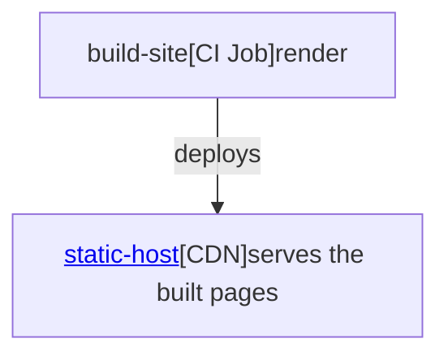

# Custom Fonts & Styling Inside Nodes

Mermaid node labels are not limited to one flat line of text. Because this plugin runs Mermaid
with HTML labels, you can put real HTML inside a node — `<span>`, `<a>`, `<br/>` — and style each
part with CSS. The example below uses that to give every node a three-tier
[C4-model](https://c4model.com/) look: a bold name, a small italic stereotype, and a muted detail
line. Pan/zoom and hover tooltips keep working on the styled diagram.

## Example

Hover a node for its tooltip; use the buttons (top-right) or drag to pan/zoom.

<!-- markdownlint-disable MD013 -->

<!-- markdownlint-enable MD013 -->

```mermaid-tooltips
- node: build
  text: "A **CI job**. The `render` step converts the docs Markdown into static HTML."
- node: cdn
  text: "The **CDN** that serves the built pages. Click the name to open the site."
```

## The recipe

Three ingredients, no JavaScript of your own.

### 1. HTML in the label

Wrap each line in a semantic span, with **no separator** between the spans:

```text
"<span class='c4-name'>Name</span><span class='c4-type'>[Kind]</span><span class='c4-detail'>detail</span>"
```

Three authoring rules that matter:

- **Do not put `<br/>` between the tiers.** The tier spans are `display: block` (see the CSS below),
  so they already stack on their own lines; adding a `<br/>` as well inserts a second, empty line and
  the node looks double-spaced. Concatenate the spans directly. Keep `<br/>` only for an intentional
  break *inside* one tier (e.g. a long detail you deliberately want on two lines).
- **Single-quote the HTML attributes** (`class='…'`, `href='…'`). The whole label is delimited by
  Mermaid's `["…"]`; a raw double-quote inside it closes that string early and Mermaid draws
  `Syntax error in text`.
- **Escape a literal `&`** as `&amp;`, or Mermaid's lexer reads it as node chaining.

### 2. One stylesheet

Size the tiers in a CSS file and list it in `extra_css` (this site ships it in
`docs/css/diagram-colors.css`):

```css
/* C4-style in-node label tiers. NOT scoped under .mermaid (see notes below). */
.c4-name {
  display: block;
  font-weight: 700;
  font-size: 17px !important;
  line-height: 1.4;
  white-space: nowrap;
}
.c4-type {
  display: block;
  font-weight: 500;
  font-size: 12px !important;
  font-style: italic;
  opacity: 0.88;
  letter-spacing: 0.03em;
}
.c4-detail {
  display: block;
  font-weight: 550;
  font-size: 14px !important;
  opacity: 0.92;
  white-space: nowrap;
}
```

```yaml
# mkdocs.yml
extra_css:
  - css/diagram-colors.css
```

Two non-obvious rules, both about how Mermaid sizes a node box:

- **Do not scope the selectors under `.mermaid`** (use bare `.c4-name`, not `.mermaid .c4-name`).
  Mermaid measures each HTML label in a probe element detached from the rendered `.mermaid`
  container; a `.mermaid …` rule does not match in that probe, so the box would be sized for default
  16px text and then clip your larger tiers. Bare class selectors apply during measurement too, and
  these names only ever appear inside diagrams, so the un-scoped selector is safe.
- **`white-space: nowrap` on `.c4-name`.** Mermaid measures the name as one line; if a long name
  wraps, the drawn box is one line too short and clips the bottom tier. `nowrap` grows the box width
  (which Mermaid measures correctly) instead.

The `!important` on `font-size` beats Mermaid's own `.nodeLabel` size, which would otherwise flatten
all three tiers to one size. (It also makes these sizes harder to override downstream — intended
here, since the goal is to win over Mermaid's defaults.)

### 3. HTML labels enabled

Mermaid must run with `htmlLabels: true`. That is the default for flowcharts, and this plugin's
reference setup runs with `securityLevel: "loose"` (needed for inline `<a>` links and for pan/zoom),
so for flowcharts there is usually nothing to configure.

## Why pan/zoom keeps working

This plugin's pan/zoom engine only attaches to a `<div>` or `` (it checks `elem.nodeName`); a
`<pre>` is silently skipped. Which wrapper you get depends on the superfences fence format:

| Fence `format`                           | Rendered wrapper                                  | Pan/zoom   | In-node HTML |
| ---------------------------------------- | ------------------------------------------------- | ---------- | ------------ |
| `mermaid2.fence_mermaid` (recommended)   | `<div class="mermaid">RAW source</div>`           | works      | works as-is  |
| `pymdownx.superfences.fence_code_format` | `<pre class="mermaid"><code>ESCAPED</code></pre>` | needs care | needs care   |

This site uses `mermaid2.fence_mermaid` (raw `<div>`), so the recipe above is the whole story —
pan/zoom and the C4 tiers both just work, with no custom JavaScript.

If a project is forced onto `fence_code_format`, it needs a heavier `mermaid-init.js` that captures
each diagram's source synchronously at script-eval time, swaps the `<pre>` for a `<div>`, and renders
via `mermaid.render(id, source)` with `htmlLabels: true` and the tier CSS repeated as Mermaid
`themeCSS` (the page stylesheet does not apply inside Mermaid's off-DOM measurement probe). See
`AGENTS.md` in the repo for the full rationale. Prefer `fence_mermaid` so you never need that.

## Dark mode

The tier styles set size/weight/style/opacity, not color, so they work in both light and dark
automatically. Node fill/text colors come from your `classDef` tokens (e.g. `accentNode`,
`successNode`) in the same stylesheet. Because the tiers use `opacity` rather than a fixed color, the
muted stereotype stays legible on a dark node fill.

One sharp edge: write those `classDef` color rules with the **descendant** combinator
(`.mermaid .accentNode *`), not the child combinator (`.mermaid .accentNode > *`). Mermaid wraps the
label text in a nested `<span class="nodeLabel">` that carries its own dark `color:#333`; a child-only
rule colors the node wrapper but never reaches that span, so the tier text inherits `#333` and renders
dark-on-dark — fine on a light fill, unreadable on a dark fill (the classic "looks ok in dark mode,
invisible in light mode" symptom). The descendant combinator pushes the intended per-node text color
all the way down to `.nodeLabel` and the tier spans. Trade-off: it also recolors inline `<a>` links to
the node's text color (they lose the default link blue but keep their underline); on a colored fill
that is the readable choice.
