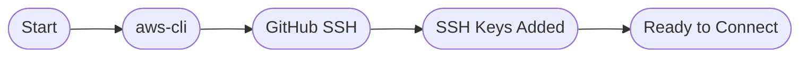
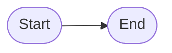
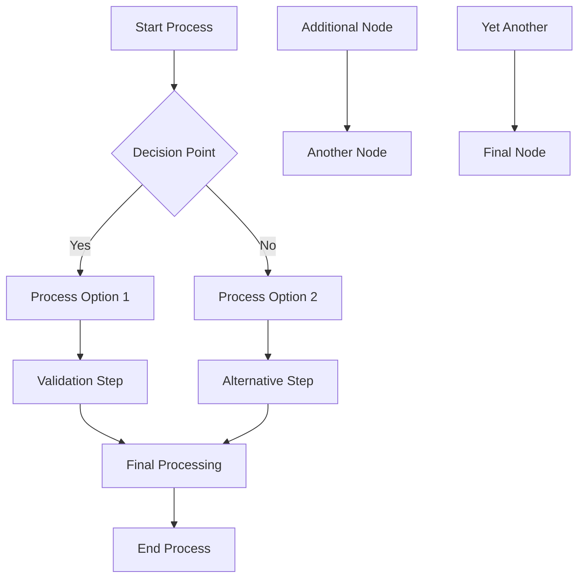
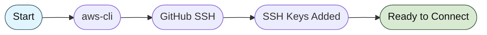
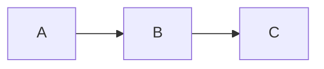

# Smart Panzoom Auto-Detection

The plugin now automatically detects diagram size/complexity and only enables panzoom for larger diagrams that would benefit from zoom functionality.

## Small Diagrams with 5 nodes



## Small Diagrams (Auto-Disabled)

Small/simple diagrams automatically have panzoom disabled since they don't need zoom functionality:



## Large Diagrams (Auto-Enabled)

Complex diagrams automatically get panzoom enabled:



## Manual Override: Force Disable

You can explicitly disable panzoom even for large diagrams:



## Manual Override: Force Enable

You can explicitly enable panzoom even for small diagrams:



## Configuration Options

You can customize the auto-detection thresholds in your `mkdocs.yml`:

```yaml
plugins:
  - hover-tooltip-popup:
      # Enable/disable smart auto-detection
      auto_enable: true  # default: true

      # Customize thresholds for auto-detection
      auto_enable_threshold_lines: 8    # default: 8 lines
      auto_enable_threshold_nodes: 6    # default: 6 nodes
      auto_enable_threshold_edges: 5    # default: 5 connections
      auto_enable_threshold_chars: 200  # default: 200 characters

      # Other existing options...
      show_zoom_buttons: true
      full_screen: true
```

## How It Works

The plugin analyzes each Mermaid diagram and counts:

- **Lines**: Number of non-empty lines in the diagram code
- **Nodes**: Number of elements (boxes, circles, decision points, etc.)
- **Edges**: Number of connections/arrows between elements
- **Characters**: Total character count of the diagram

If any metric exceeds its threshold, panzoom is automatically enabled. You can always override this behavior using explicit YAML metadata.

## Legacy Behavior

To disable auto-detection and enable panzoom for all diagrams (old behavior):

```yaml
plugins:
  - hover-tooltip-popup:
      auto_enable: false  # Disables smart detection
```
