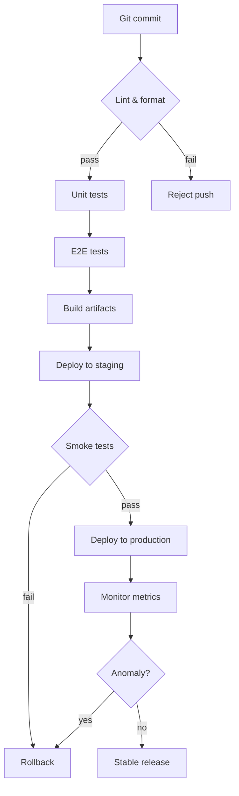
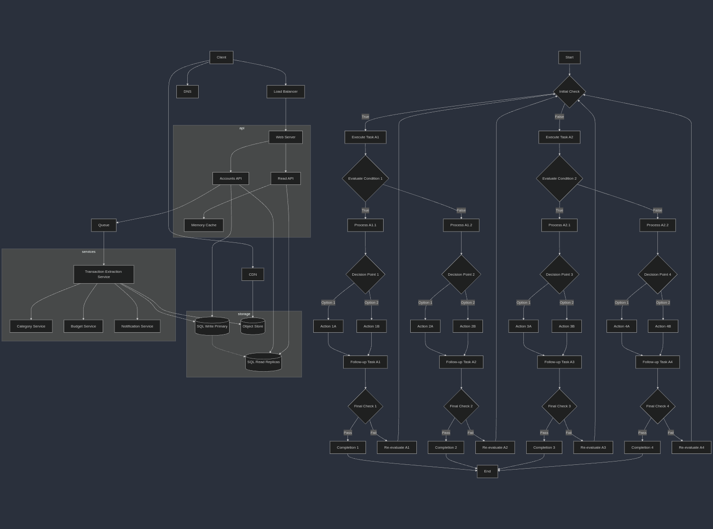
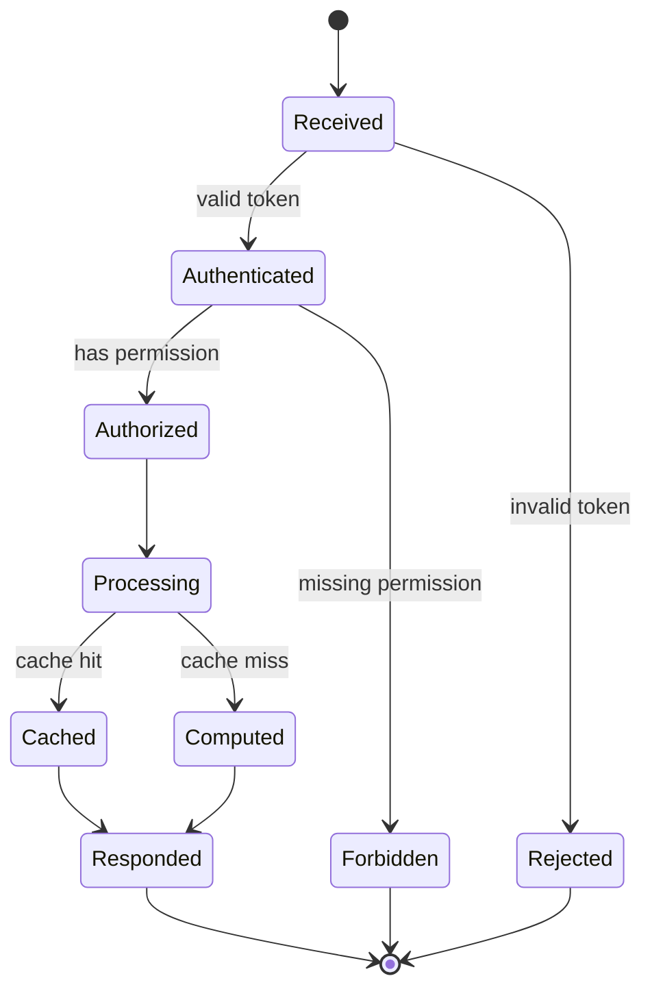
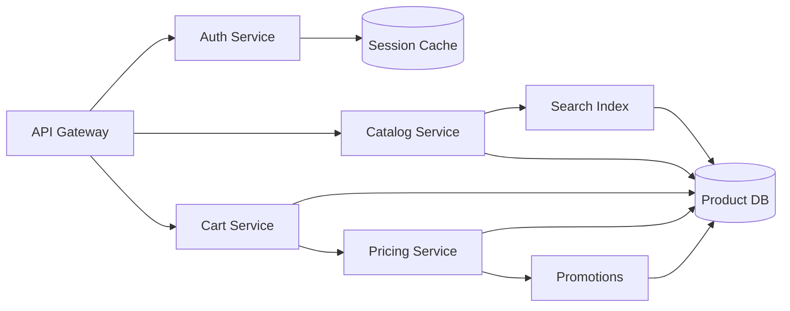

# Tooltips + Zoom Together

Three complex diagrams, each large enough that auto-detection enables pan/zoom, and each
annotated with per-node hover tooltips. Drag to pan, scroll to zoom, and hover any
labelled node to see its Markdown popup.

## CI/CD pipeline



```mermaid-tooltips
- node: Lint
  text: |
    ### Lint &amp; format

    Runs **ruff** and *ruff-format*. A failure here **blocks** the push.

    See the [contributing guide](https://elgalu.github.io/mkdocs-hover-tooltip-popup/).

    
- node: Unit
  text: "Fast tests with `-m \"not e2e\"`. See the [testing docs](https://elgalu.github.io/mkdocs-hover-tooltip-popup/)."
- node: E2E
  text: "Headless Chromium via *Playwright*. <br>Skipped if no browser is installed."
- node: Prod
  text: "Promotes the artifact to production. Requires green smoke tests."
- node: Rollback
  text: "Reverts to the last stable release. Triggered by failed smoke tests **or** a monitoring anomaly."
```

## Request lifecycle



```mermaid-tooltips
- node: Authenticated
  text: "The caller's **token** was verified. Identity is known but permissions are not yet checked."
- node: Authorized
  text: "Permission check passed. The request may now touch protected resources."
- node: Processing
  text: |
    #### Processing stage

    Business logic runs here. Supports **bold**, *emphasis*, `inline code`,
    and a [deep link](https://elgalu.github.io/mkdocs-hover-tooltip-popup/Mermaid/).

    { width="150" }
- node: Cached
  text: "Served from the cache layer: no recomputation needed."
- node: Computed
  text: "Cache miss: the result is computed fresh and then stored."
```

## Service dependency graph



```mermaid-tooltips
- node: Gateway
  text: |
    ### API Gateway

    Single **entry point**. Routes *every* external request to a downstream service.

    Read the [routing rules](https://elgalu.github.io/mkdocs-hover-tooltip-popup/).

    
- node: Auth
  text: "Validates tokens against the [session cache](https://example.com). Stateless otherwise."
- node: Catalog
  text: "Owns product metadata. Reads from the *Product DB* and the search index."
- node: Pricing
  text: "Computes final price including `promotions`. <br>Hot path: heavily cached."
- node: Promo
  text: "Applies active campaigns and discount rules."
```
