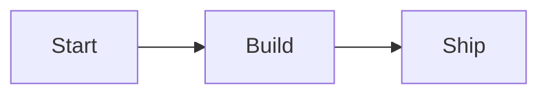

# Hover Tooltip Popups

The headline feature: hover over a diagram node to show a Markdown-rendered popup. It
appears to the left of the node (flips to the right on a viewport edge) without covering
it, and hides on mouse-leave.

Tooltips are independent of pan/zoom: they work on any Mermaid diagram, including small
ones that auto-detection leaves without pan/zoom controls.

## Basic example

Hover over `Start`, `Build`, or `Ship` below.



```mermaid-tooltips
- node: Start
  text: "The **entry point**. See the [docs](https://elgalu.github.io/mkdocs-hover-tooltip-popup/)."
- node: Build
  text: "Compiles everything. <br>Supports `inline code` and *emphasis*."
- node: Ship
  text: "Publishes the result."
```

## How to declare tooltips

Place a `mermaid-tooltips` fenced block immediately after the `mermaid` block it annotates.
It is a YAML list of `{node, text}` entries, where `text` is full Markdown rendered at
build time.

````markdown


```mermaid-tooltips
- node: Start
  text: "The **entry point**. See the [docs](https://example.com)."
- node: Build
  text: "Supports `inline code`, *emphasis*, and <br>line breaks."
```
````

## Targeting a node

- Use the node's id (e.g. `Start`) when it matches `^[A-Za-z][A-Za-z0-9_-]*$`.
- Otherwise the value is matched against the node's visible label text.

## Scope (v1)

Per-node hover tooltips are Mermaid-only in v1. Edges are not targetable because Mermaid
edges have no stable id. D2 and image tooltips are not yet supported.
