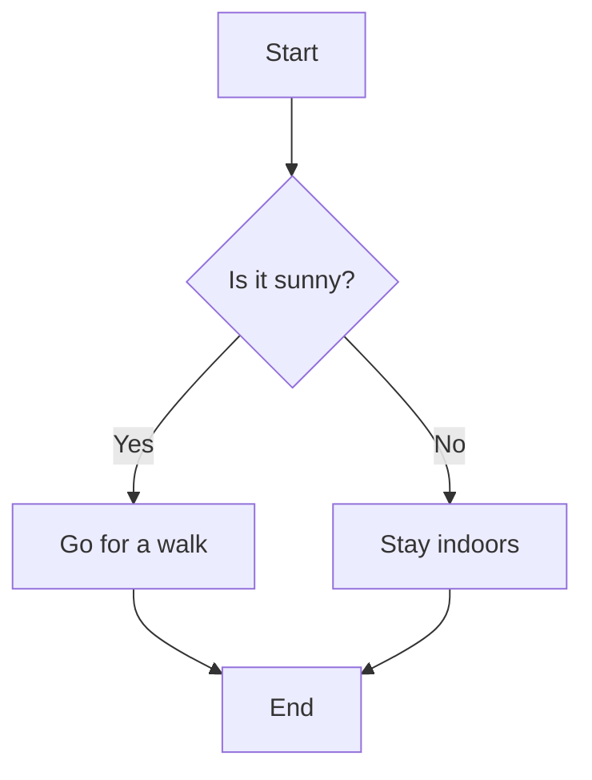

# Usage

!!! info
    The theme is currently optimized for [material for mkdocs](https://squidfunk.github.io/mkdocs-material/).

## Mouse and trackpad

By default the plugin uses canvas-style navigation (direct manipulation, like an infinite canvas):

- Scroll wheel, or a trackpad two-finger drag, pans the diagram.
- ++ctrl++ (or ++cmd++) + scroll, and a trackpad pinch, zoom in and out centered on the cursor.
- Right-mouse drag pans. Left click stays free, so you can click nodes and the links inside tooltips.

To use the older modifier-key behavior instead, set `navigation: classic` (then ++alt++ + drag/scroll
pans/zooms; the modifier is [configurable or disabled](./index.md#use-different-key)).

## Keyboard

You can also control it with your keyboard.

Use the arrow keys to move it around and the ++plus++ and ++minus++ key to zoom in and out.
